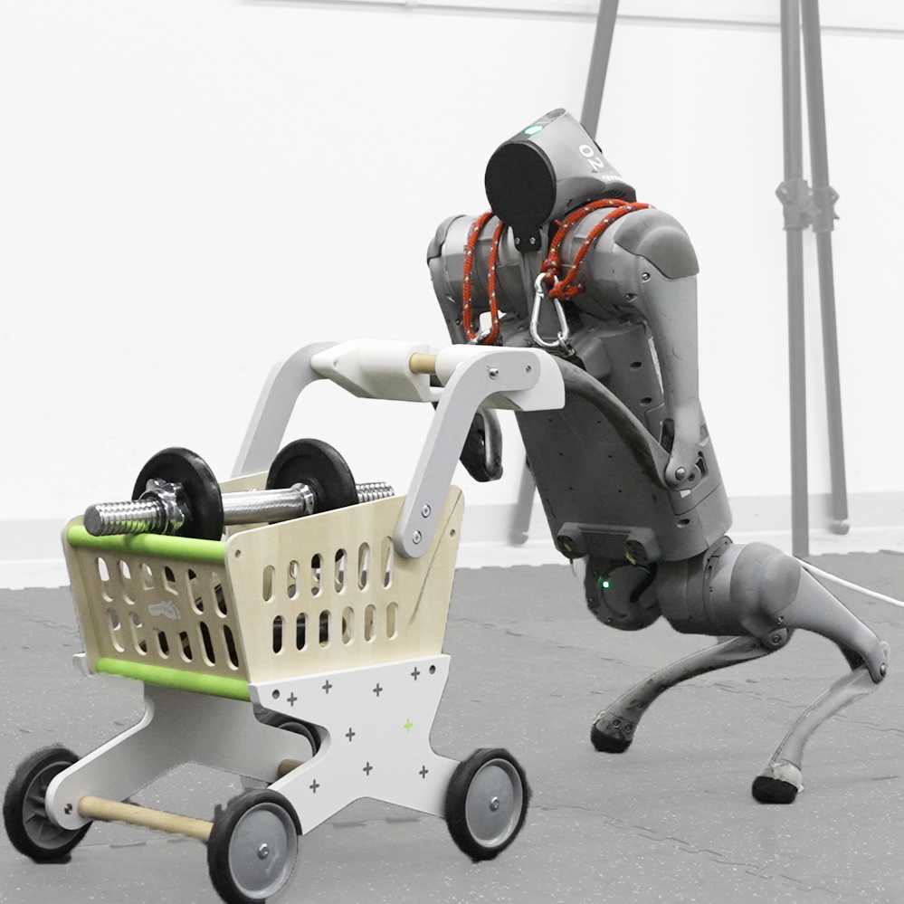

# RAMBO: RL-augmented Model-based Whole-body Control for Loco-manipulation

[Jin Cheng](https://jin-cheng.me/)<sup>1</sup>, [Dongho Kang](https://donghokang.net/)<sup>1</sup>, [Gabriele Fadini](https://www.zhaw.ch/en/about-us/person/fadi)<sup>1</sup>, [Guanya Shi](https://www.gshi.me/)<sup>2</sup>, [Stelian Coros](https://crl.ethz.ch/people/coros/index.html)<sup>1</sup>

<sup>1</sup> ETH Zurich, <sup>2</sup> Carnegie Mellon University


Accepted to IEEE Robotics and Automation Letters (RA-L) 2025.

[Paper](https://arxiv.org/pdf/2504.06662) | [Arxiv](http://arxiv.org/abs/2504.06662) | [Video](https://youtu.be/VdZxhLNG6wQ) | [Website]( https://jin-cheng.me/rambo.github.io/)

[](https://docs.isaacsim.omniverse.nvidia.com/latest/index.html)
[](https://docs.python.org/3/whatsnew/3.10.html)
[](https://releases.ubuntu.com/20.04/)


## Installation

1. Install isaacsim in a conda environment
    ```
    conda create -n rambo python=3.10
    conda activate rambo
    pip install --upgrade pip
    pip install 'isaacsim[all,extscache]==4.5.0' --extra-index-url https://pypi.nvidia.com
    ```

2. Install isaaclab and RAMBO source. We use our in-house learning framework based on [rsl-rl](https://github.com/leggedrobotics/rsl_rl), which we call `crl2`.
    ```
    pip install -e source/isaaclab
    pip install -e source/isaaclab_assets
    pip install -e source/isaaclab_mimic
    pip install -e source/isaaclab_rl
    pip install -e source/isaaclab_tasks
    pip install -e source/crl2
    ```

3. Install other dependencies
    ```bash
    pip install wandb
    pip install qpth
    ```

## Train & Play
To make `wandb` work, do `wandb login` first in conda environment. And export `WANDB_USERNAME` in your shell.

Due to memory constraints, wandb will upload the videos after the training is done. You can still view the training videos locally in the log folder.

To train:
```bash
# in the root directory of IsaacLab
python scripts/reinforcement_learning/crl2/train.py --task Isaac-RAMBO-Quadruped-Go2-v0 --headless --logger=wandb --video
#python scripts/reinforcement_learning/crl2/train.py --task Isaac-RAMBO-Biped-Go2-v0 --headless --logger=wandb --video
```

To play:
```bash
# in the root directory of IsaacLab
python scripts/reinforcement_learning/crl2/play.py --task Isaac-RAMBO-Quadruped-Go2-v0 --num_envs 10
#python scripts/reinforcement_learning/crl2/play.py --task Isaac-RAMBO-Biped-Go2-v0 --num_envs 10
```
## Citation
If you use this code in your research, please cite our paper:
```bibtex
@article{cheng2025rambo,
  title={RAMBO: RL-augmented Model-based Optimal Control for Whole-body Loco-manipulation},
  author={Cheng, Jin and Kang, Dongho and Fadini, Gabriele and Shi, Guanya and Coros, Stelian},
  journal={arXiv preprint arXiv:2504.06662},
  year={2025}
}
```

## License

This codebase is under [CC BY-NC 4.0 license](https://creativecommons.org/licenses/by-nc/4.0/deed.en). You may not use the material for commercial purposes, e.g., to make demos to advertise your commercial products.


## Acknowledgements

- [CAJun](https://github.com/yxyang/cajun/): Our QP based optimization module is inspired by the `cajun` project.
- [RSL_RL](https://github.com/leggedrobotics/rsl_rl): Our RL framework `crl2` is based on `rsl_rl` library for the PPO implementation.
- [IsaacLab](https://github.com/isaac-sim/IsaacLab): We use the `isaaclab` library for the RL training and evaluation.


## Contact

Feel free to open an issue or discussion if you encounter any problems or have questions about this project.

For collaborations, feedback, or further inquiries, please reach out to:

- Jin Cheng: [jin.cheng@inf.ethz.ch](mailto:jin.cheng@inf.ethz.ch).

We welcome contributions and are happy to support the community in building upon this work!
